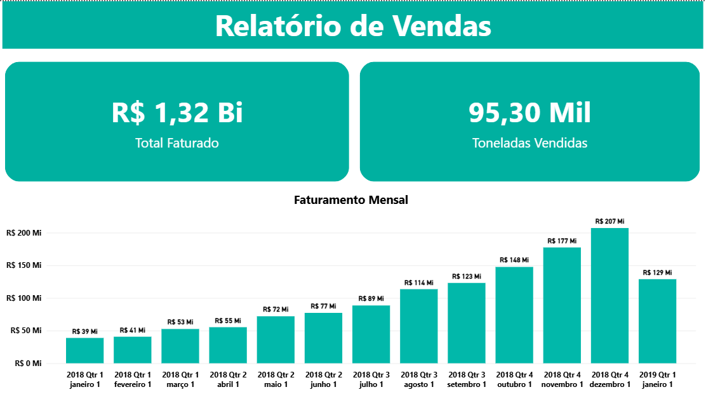
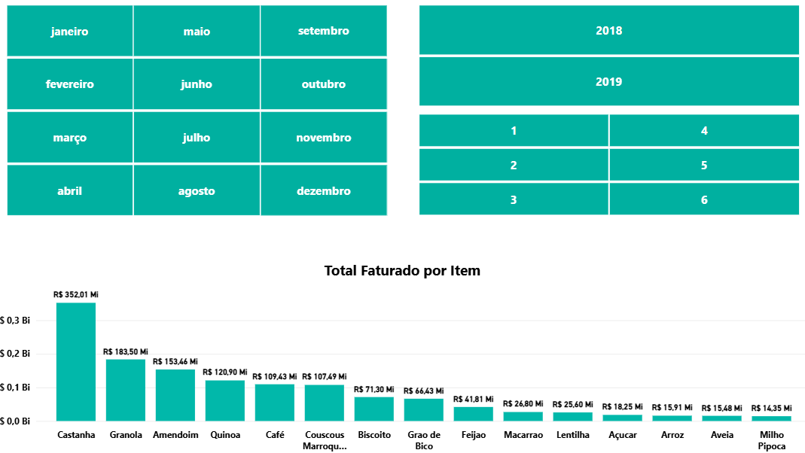
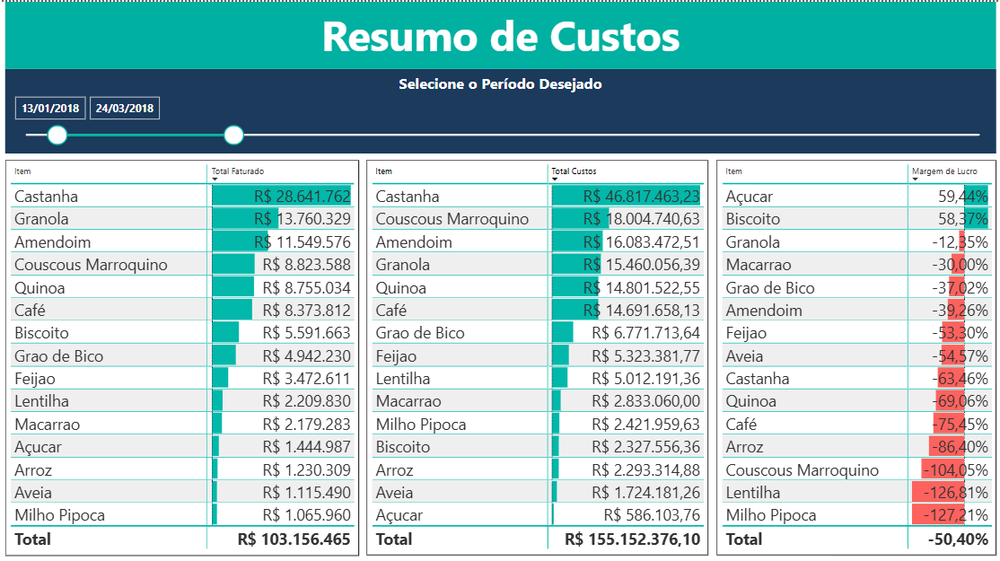

# Dashboard MAP — Power BI

Dashboard de análise de vendas, custos e rentabilidade por produto, desenvolvido no Power BI com dados tratados no Excel.

---

## Visão geral

O projeto cobre **13 meses de operação (jan/2018 a jan/2019)** e responde perguntas como:

- Quais produtos têm maior margem de lucro?
- Onde os custos estão pesando mais?
- Como o faturamento evoluiu ao longo do tempo?

---

## Indicadores analisados

- Total faturado e toneladas vendidas
- Faturamento mensal e por produto
- Custos totais (estoque, produção e transporte)
- Lucro mensal e margem de lucro por produto
- Resumo de custos filtrável por período

---

## Ferramentas

Power BI · Excel (ETL e tratamento dos dados)

---

## Preview

### Análise de Vendas

### Faturamento por Produto

### Resumo de Custos

