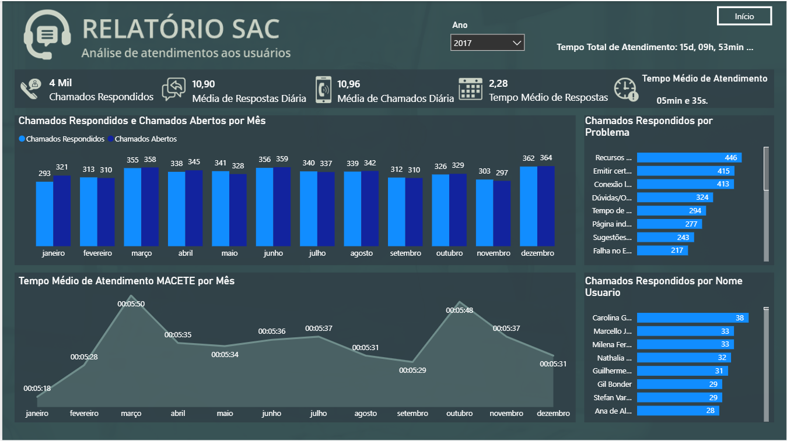
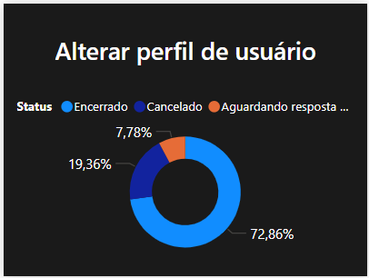

# Dashboard SAC — Power BI

Dashboard de análise de atendimentos ao usuário desenvolvido no Power BI, com foco em eficiência operacional e identificação de gargalos no suporte.

---

## Visão geral

O projeto analisa o histórico completo de chamados de um serviço de atendimento ao cliente (SAC), respondendo perguntas como:

- Quantos chamados são abertos e respondidos por mês?
- Qual o tempo médio de atendimento por tipo de problema?
- Quais problemas mais consomem tempo da equipe?
- Qual a performance individual de cada atendente?

---

## Indicadores analisados

- Total de chamados respondidos (4 Mil)
- Média de chamados e respostas diárias
- Tempo médio de atendimento global (05min e 35s)
- Chamados respondidos vs. abertos por mês
- TOP 5 problemas por tempo médio de atendimento
- Status dos chamados: Encerrado, Cancelado e Aguardando resposta
- Performance por atendente e por tipo de problema

---

## Ferramentas

Power BI · DAX

---

## Preview

### Visão Geral do Dashboard

### Análise por Tipo de Problema

