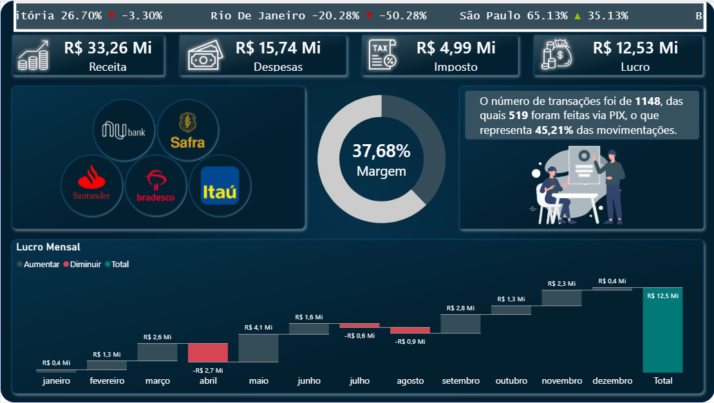

# Dashboard Financeiro — Setor Bancário | Power BI

Dashboard de análise financeira com foco no setor bancário, com ticker animado por cidade, gráfico waterfall de lucro mensal, narrativa inteligente e margem de lucro em gauge.

---

## Objetivo

Monitorar receita, despesas, impostos e lucro de operações financeiras — identificando meses de queda, recuperação e o peso das transações via PIX no volume total.

---

## Indicadores principais

- R$ 33,26 Mi em Receita
- R$ 15,74 Mi em Despesas
- R$ 4,99 Mi em Impostos
- R$ 12,53 Mi em Lucro
- 37,68% de Margem de Lucro
- 1.148 transações — 519 via PIX (45,21%)

---

## O que o dashboard mostra

- Ticker animado com % de participação e variação por cidade (▲▼)
- KPIs: Receita, Despesas, Imposto, Lucro
- Logos dos principais bancos: Nubank, Safra, Santander, Bradesco, Itaú
- Gauge de Margem de Lucro
- Narrativa inteligente com dados de transações e PIX
- Waterfall de Lucro Mensal (Aumentar / Diminuir / Total)

---

## Ferramentas

Power BI · DAX · Power Query

---

## Preview

### Painel Principal

