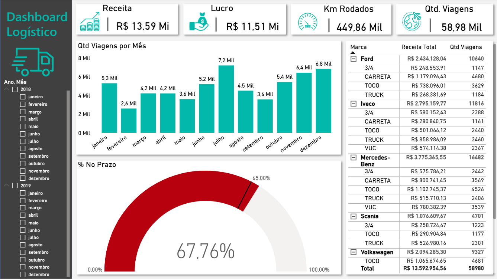

# Dashboard Logístico | Power BI

Dashboard de análise de operações logísticas com indicadores de receita, lucro, km rodados, viagens e performance no prazo de entrega.

---

## Objetivo

Monitorar a performance operacional de uma frota logística — identificando os melhores e piores resultados por marca, tipo de veículo e período.

---

## Indicadores principais

- R$ 13,59 Mi em Receita Total
- R$ 11,51 Mi em Lucro
- 449,86 Mil Km Rodados
- 58,98 Mil Viagens realizadas
- 67,76% das entregas no prazo

---

## O que o dashboard mostra

- Quantidade de Viagens por Mês (jan/2018 a dez/2019)
- % No Prazo — gauge interativo
- Tabela hierárquica por Marca e Tipo de Veículo com drill-down (Ford, Iveco, Mercedes-Benz, Scania, Volkswagen, Volvo)
- Filtro lateral por Ano e Mês

---

## Ferramentas

Power BI · DAX · Power Query

---

## Preview

### Painel Principal

