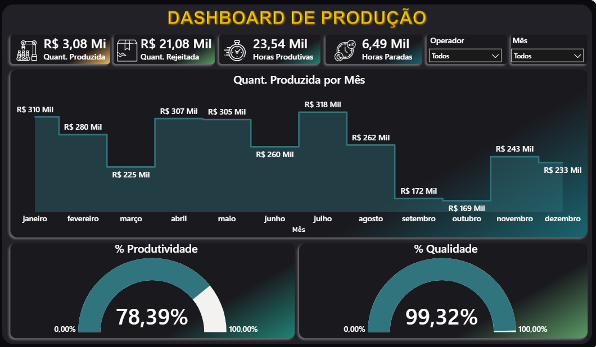

# Dashboard de Produção | Power BI

Dashboard de análise de performance industrial com indicadores de produtividade, qualidade, horas produtivas e paradas — com visual dark e filtros por operador e mês.

---

## Objetivo

Monitorar a performance operacional de uma linha de produção, identificando variações mensais na quantidade produzida, índices de qualidade e produtividade ao longo do ano.

---

## Indicadores principais

- 3,08 Mi de unidades produzidas
- 21,08 Mil unidades rejeitadas
- 23,54 Mil horas produtivas
- 6,49 Mil horas paradas
- 78,39% de Produtividade
- 99,32% de Qualidade

---

## O que o dashboard mostra

- KPIs com ícones: Quant. Produzida, Quant. Rejeitada, Horas Produtivas, Horas Paradas
- Quantidade Produzida por Mês (gráfico de área com degraus)
- % Produtividade — gauge interativo
- % Qualidade — gauge interativo
- Filtros por Operador e Mês

---

## Ferramentas

Power BI · DAX · Power Query

---

## Preview

### Painel Principal

