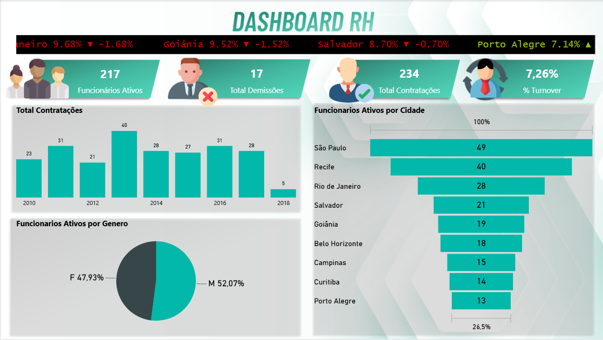
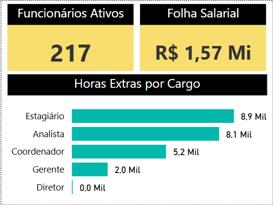
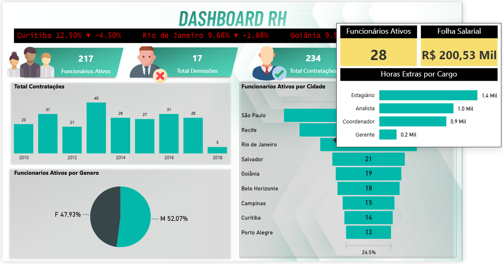

# Dashboard RH | Power BI

Dashboard de análise de recursos humanos com ticker animado por cidade, tooltip customizado e indicadores de contratações, demissões e turnover.

---

## Objetivo

Monitorar os principais indicadores de RH de uma empresa — funcionários ativos, contratações, demissões, turnover, distribuição por cidade e gênero — com recursos avançados de interatividade.

---

## Páginas do dashboard

**1. Dashboard Principal**
- Ticker animado com % de funcionários e variação por cidade (▲▼)
- KPIs com ícones ilustrativos: Funcionários Ativos, Total Demissões, Total Contratações, % Turnover
- Total Contratações por Ano (2010–2018)
- Funcionários Ativos por Cidade
- Funcionários Ativos por Gênero

**2. Tooltip Customizado**
- Folha Salarial e Funcionários Ativos por cidade selecionada
- Horas Extras por Cargo (Estagiário, Analista, Coordenador, Gerente, Diretor)

---

## Indicadores principais

- 217 Funcionários Ativos
- 17 Demissões
- 234 Contratações totais
- 7,26% de Turnover
- Folha Salarial total: R$ 1,57 Mi

---

## Ferramentas

Power BI · DAX · Power Query

---

## Preview

### Dashboard Principal

### Tooltip por Cidade

### Tooltip — Horas Extras

