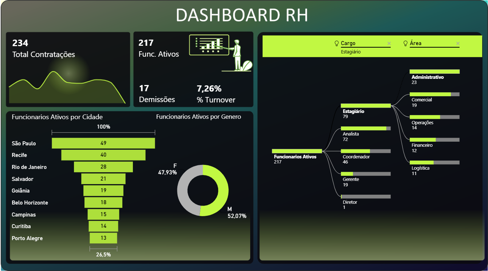
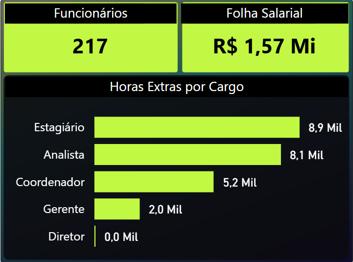

# Dashboard RH | Power BI

Dashboard de análise de recursos humanos com visual dark/verde, árvore de decomposição por cargo e área, tooltip customizado com folha salarial e horas extras por cargo.

---

## Objetivo

Monitorar os principais indicadores de RH — contratações, demissões, turnover, distribuição por cidade, gênero, cargo e área — com drill-down hierárquico e tooltip interativo.

---

## Páginas do dashboard

**1. Dashboard Principal**
- KPIs: Total Contratações (sparkline), Func. Ativos, Demissões, % Turnover
- Funcionários Ativos por Cidade (barras horizontais)
- Funcionários Ativos por Gênero (rosca)
- Árvore de decomposição: Funcionários Ativos → Cargo → Área

**2. Tooltip Customizado**
- Funcionários e Folha Salarial por cidade selecionada
- Horas Extras por Cargo (Estagiário, Analista, Coordenador, Gerente, Diretor)

---

## Indicadores principais

- 234 Contratações totais
- 217 Funcionários Ativos
- 17 Demissões
- 7,26% de Turnover
- Folha Salarial: R$ 1,57 Mi
- São Paulo lidera com 49 funcionários ativos

---

## Ferramentas

Power BI · DAX · Power Query

---

## Preview

### Dashboard Principal

### Tooltip — Folha Salarial e Horas Extras

