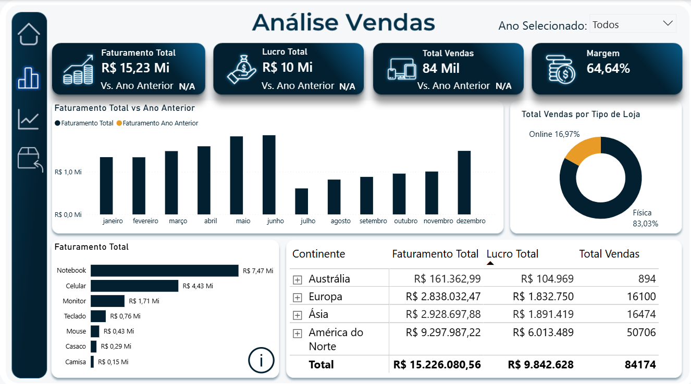
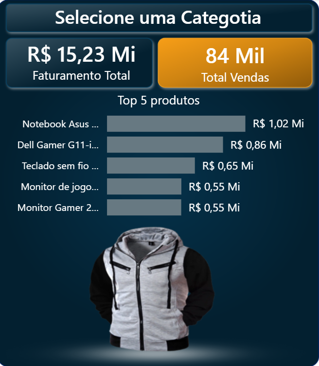
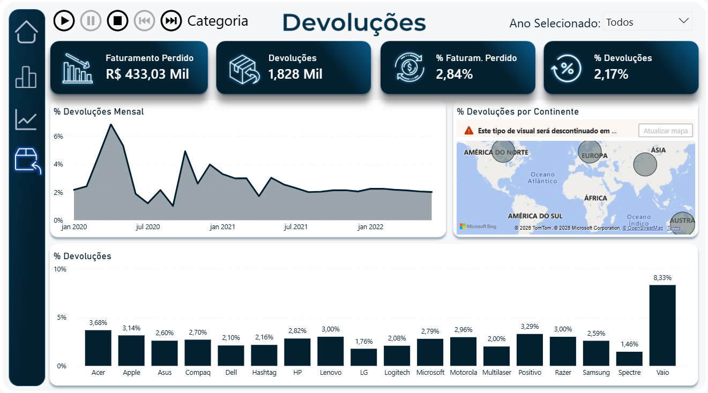

# Dashboard de Vendas — Análise Completa | Power BI

Dashboard avançado de análise de vendas com múltiplas páginas, tooltips customizados, animações e narrativa inteligente.

---

## Objetivo

Construir um relatório completo de vendas que permita analisar faturamento, lucro, devoluções e performance por produto, marca e continente — com recursos avançados de interatividade e visualização.

---

## Páginas do dashboard

**1. Capa** — navegação para o dashboard

**2. Geral**
- KPIs com comparação vs. Ano Anterior (Faturamento, Lucro, Total Vendas, Margem)
- Faturamento Total vs Ano Anterior (gráfico mensal)
- Faturamento por Categoria (gráfico de barras)
- Vendas por Tipo de Loja (online vs. física)
- Tabela por Continente com drill-down

**3. Análises**
- Ticker animado com variação por categoria (▲▼)
- Filtros por Marca, Tipo e Nome do Produto
- Árvore de decomposição por continente e marca
- Narrativa inteligente: Melhor Produto e Melhor Loja gerados automaticamente

**4. Devoluções**
- Animação por categoria (play/pause/stop)
- % Devoluções Mensal (gráfico de área)
- % Devoluções por Continente (mapa)
- % Devoluções por Marca

**5. Tooltip Vendas** — card customizado com imagem do produto + Top 5 ao passar o mouse

**6. Tooltip Devoluções** — card customizado com devoluções por produto

---

## Recursos utilizados

- Ticker animado com indicadores de alta/baixa
- Tooltips customizados com imagem do produto e Top 5
- Árvore de decomposição (Decomposition Tree)
- Narrativa inteligente (Smart Narrative)
- Animação por categoria com controles de reprodução
- Navegação lateral com ícones
- Comparação vs. Ano Anterior via DAX

---

## Ferramentas

Power BI · DAX · Power Query

---

## Preview

### Capa

### Visão Geral

### Tooltip Customizado

### Devoluções

