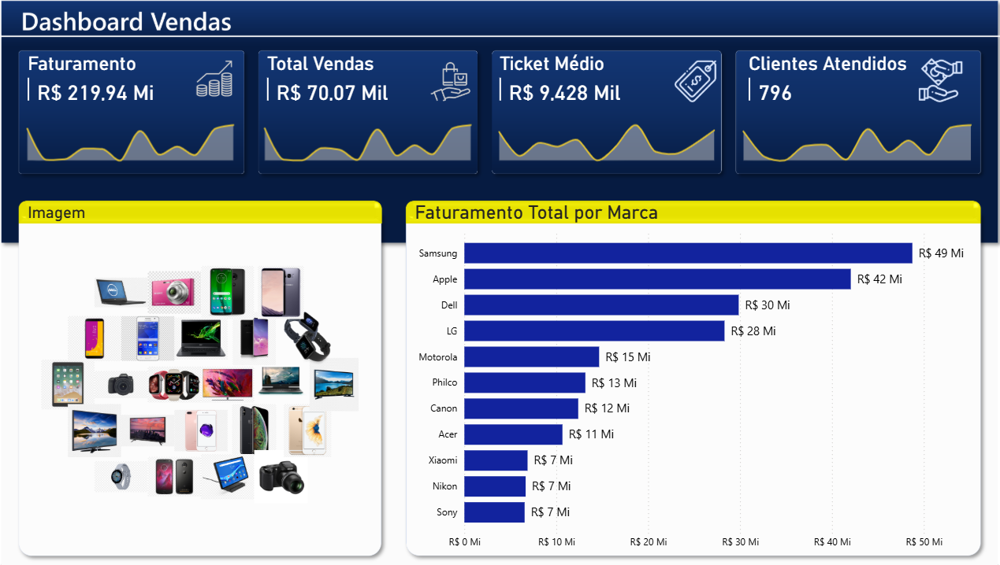
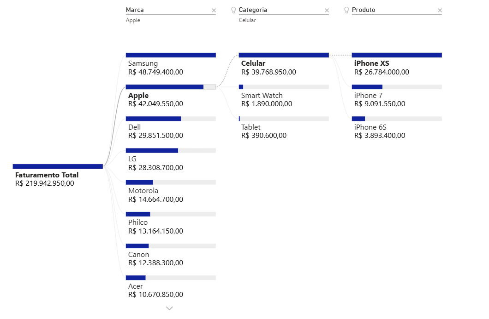

# Dashboard Vendas Comercial | Power BI

Dashboard de análise de vendas com KPIs em cards animados, seleção visual por imagem de produto e árvore de decomposição por marca, categoria e produto.

---

## Objetivo

Analisar o faturamento total por marca e produto, com navegação intuitiva por categoria via imagens e drill-down hierárquico para identificar os maiores contribuintes de receita.

---

## Páginas do dashboard

**1. Relatório de Vendas**
- KPIs com sparkline: Faturamento, Total Vendas, Ticket Médio, Clientes Atendidos
- Seleção visual de categoria por imagem de produto
- Faturamento Total por Marca (gráfico de barras)

**2. Detalhamento de Produtos**
- Árvore de decomposição: Faturamento Total → Marca → Categoria → Produto
- Filtros por Marca, Categoria e Produto

---

## Indicadores principais

- R$ 219,94 Mi em Faturamento Total
- 70,07 Mil Vendas realizadas
- Ticket Médio de R$ 9.428,28
- 796 Clientes Atendidos
- Samsung lidera com R$ 49 Mi em faturamento

---

## Ferramentas

Power BI · DAX · Power Query

---

## Preview

### Relatório de Vendas

### Árvore de Decomposição

