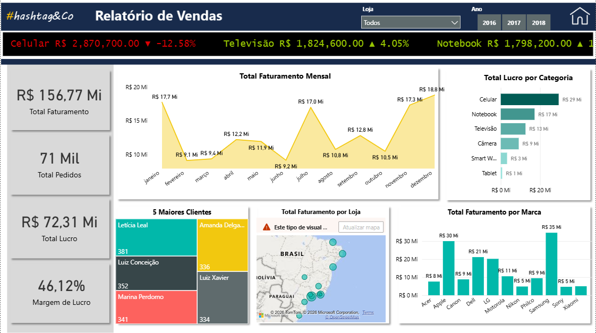
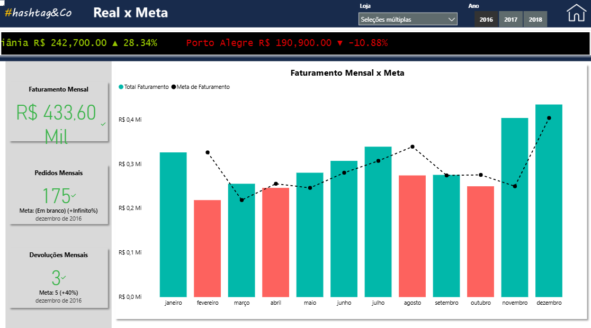
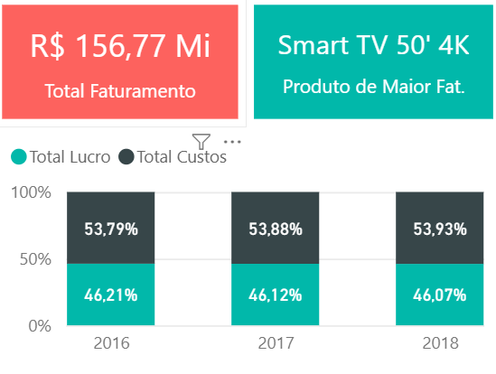

# Hashtag Eletro — Relatório de Vendas | Power BI

Dashboard de análise de vendas de uma rede de eletroeletrônicos com navegação por páginas, drill-through por cliente e loja, e acompanhamento de metas.

---

## Objetivo

Construir um relatório interativo que permita acompanhar o desempenho de vendas por categoria, marca, loja e cliente — identificando onde o negócio cresce, onde cai e onde está ficando abaixo da meta.

---

## Páginas do dashboard

**1. Capa** — navegação para Relatório e Indicadores

**2. Relatório de Vendas**
- Ticker animado com faturamento e variação por categoria (estilo bolsa de valores)
- KPIs: Total Faturamento, Total Pedidos, Total Lucro, Margem de Lucro
- Total Faturamento Mensal (gráfico de área)
- Total Lucro por Categoria
- 5 Maiores Clientes (treemap)
- Total Faturamento por Loja (mapa)
- Total Faturamento por Marca

**3. Real x Meta**
- Faturamento Mensal x Meta (gráfico combo)
- Pedidos Mensais x Meta
- Devoluções Mensais x Meta

**4. Indicadores**
- Produto de Maior Faturamento
- Evolução de Lucro x Custos por ano (2016–2018)

**5. Drill-through — Cliente**
- Total Pedidos por Marca para o cliente selecionado

**6. Drill-through — Loja**
- Total Pedidos e Total Devoluções por loja
- % de Devoluções

---

## Destaques da análise

- R$ 156,77 Mi em faturamento total com margem de 46,12%
- Celular lidera o lucro (R$ 29 Mi), mas apresenta queda de -12,58%
- Televisão em crescimento de +4,05%
- Smart TV 50' 4K é o produto de maior faturamento

---

## Ferramentas

Power BI · DAX · Power Query

---

## Preview

### Capa

### Relatório de Vendas

### Real x Meta

### Indicadores

